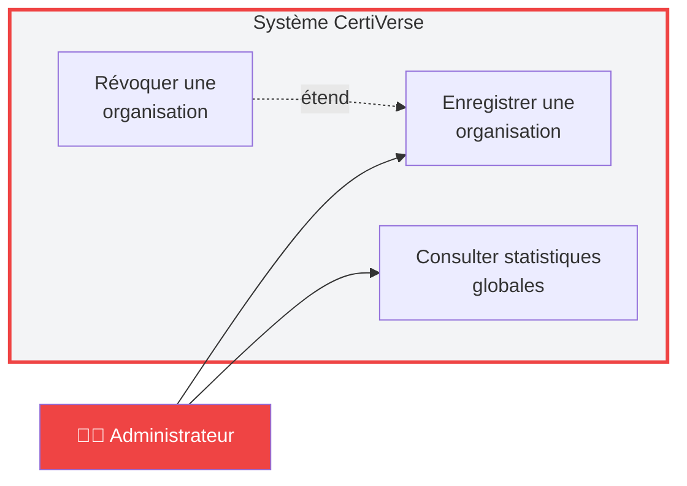
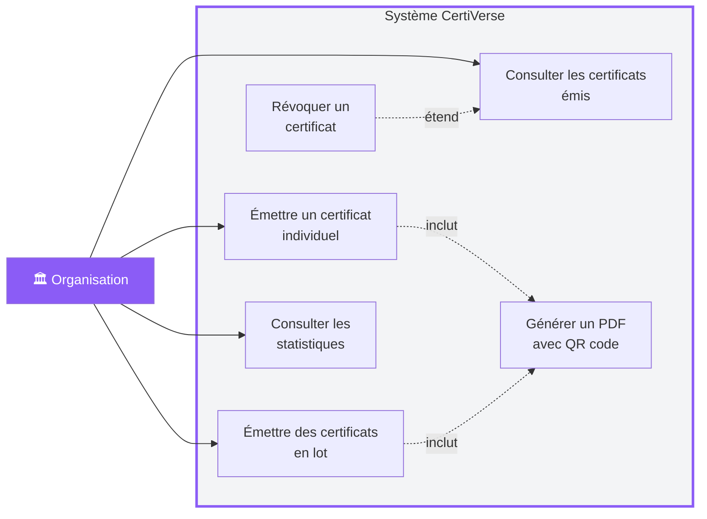
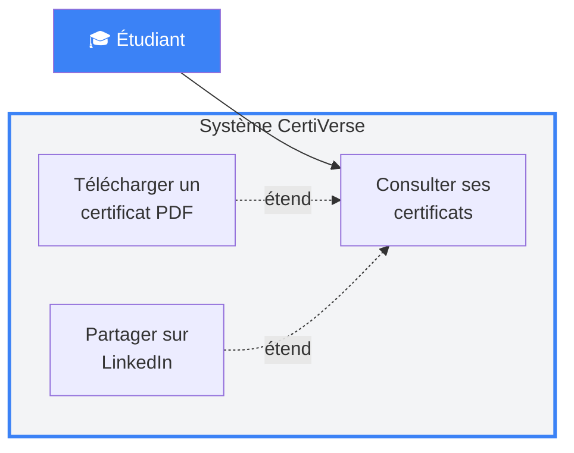
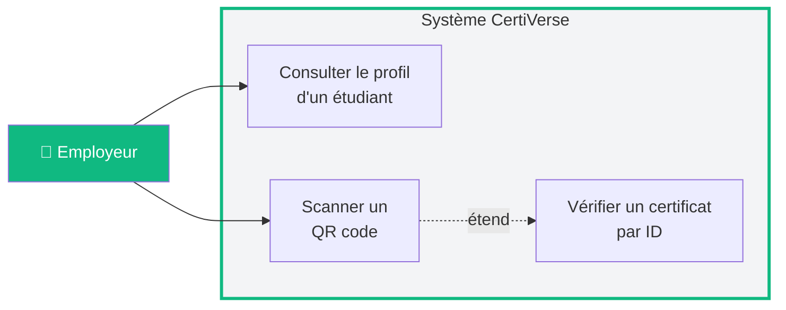
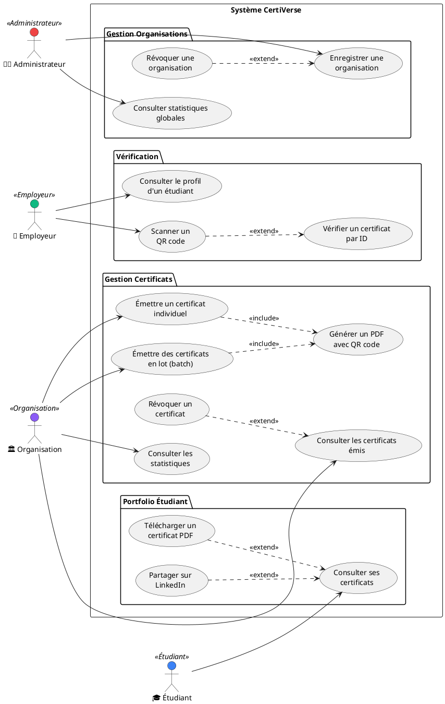
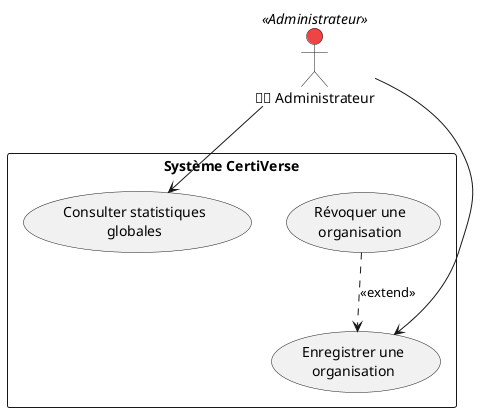
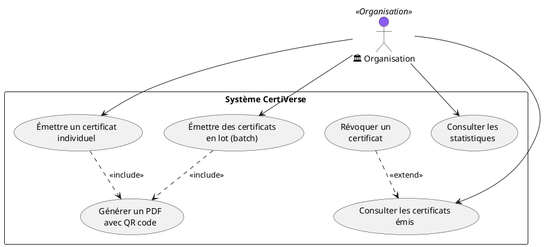
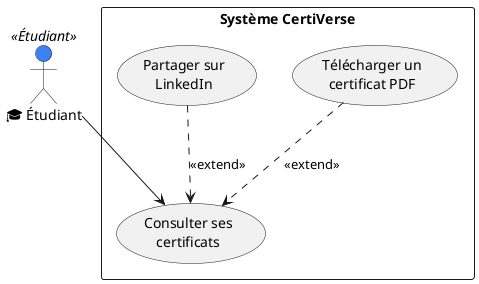
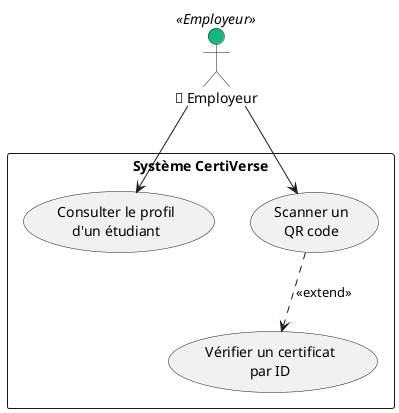

# 📊 Diagramme de Cas d'Utilisation - CertiVerse

## Vue Globale - Tous les Acteurs

```mermaid
graph TB
    subgraph System["🎓 Système CertiVerse"]
        UC1[Enregistrer une<br/>organisation]
        UC2[Révoquer une<br/>organisation]
        UC3[Consulter statistiques<br/>globales]
        
        UC4[Émettre un certificat<br/>individuel]
        UC5[Émettre des certificats<br/>en lot]
        UC6[Révoquer un<br/>certificat]
        UC7[Consulter les certificats<br/>émis]
        UC8[Consulter les<br/>statistiques]
        UC9[Générer un PDF<br/>avec QR code]
        
        UC10[Consulter ses<br/>certificats]
        UC11[Télécharger un<br/>certificat PDF]
        UC12[Partager sur<br/>LinkedIn]
        
        UC14[Vérifier un certificat<br/>par ID]
        UC15[Consulter le profil<br/>d'un étudiant]
        UC16[Scanner un<br/>QR code]
    end
    
    Admin[👨‍💼 Administrateur]
    Org[🏛️ Organisation]
    Student[🎓 Étudiant]
    Employer[💼 Employeur]
    
    Admin --> UC1
    Admin --> UC3
    UC2 -.étend.-> UC1
    
    Org --> UC4
    Org --> UC5
    Org --> UC7
    Org --> UC8
    UC4 -.inclut.-> UC9
    UC5 -.inclut.-> UC9
    UC6 -.étend.-> UC7
    
    Student --> UC10
    UC11 -.étend.-> UC10
    UC12 -.étend.-> UC10
    
    Employer --> UC15
    Employer --> UC16
    UC16 -.étend.-> UC14
    
    style Admin fill:#ef4444,color:#fff
    style Org fill:#8B5CF6,color:#fff
    style Student fill:#3b82f6,color:#fff
    style Employer fill:#10b981,color:#fff
    style System fill:#f3f4f6,stroke:#333,stroke-width:3px
```



---

## 👨‍💼 Diagramme - Administrateur



---

## 🏛️ Diagramme - Organisation



---

## 🎓 Diagramme - Étudiant



---

## 💼 Diagramme - Employeur



---

## Version PlantUML (Plus Standard)

Pour un diagramme UML plus formel, utilisez ce code avec PlantUML :



---

## PlantUML - Diagrammes Individuels par Acteur

### 👨‍💼 PlantUML - Administrateur



---

### 🏛️ PlantUML - Organisation



---

### 🎓 PlantUML - Étudiant



---

### 💼 PlantUML - Employeur



---

## 📋 Description Détaillée des Cas d'Utilisation

### 👨‍💼 Cas d'Utilisation - Administrateur

| ID | Cas d'Utilisation | Description |
|----|-------------------|-------------|
| **UC1** | **Enregistrer une organisation** | L'administrateur enregistre une nouvelle organisation en fournissant son adresse wallet, nom, email et type. Transaction blockchain confirmée. |
| **UC2** | **Révoquer une organisation** | Extension de UC1. L'administrateur révoque les droits d'émission d'une organisation qui ne respecte pas les standards. |
| **UC3** | **Consulter statistiques globales** | Visualisation du nombre total d'organisations, certificats émis, certificats révoqués, etc. |

**Préconditions :** L'utilisateur doit être connecté avec le wallet administrateur (adresse définie au déploiement).

**Relations :**
- UC2 **étend** UC1 (la révocation est une action supplémentaire sur une organisation existante)

---

### 🏛️ Cas d'Utilisation - Organisation

| ID | Cas d'Utilisation | Description |
|----|-------------------|-------------|
| **UC4** | **Émettre un certificat individuel** | L'organisation remplit un formulaire pour un étudiant, génère le PDF, l'upload sur IPFS et émet le certificat sur la blockchain. |
| **UC5** | **Émettre des certificats en lot** | Émission multiple de certificats (batch) pour plusieurs étudiants simultanément. Optimise le processus pour les promotions. |
| **UC6** | **Révoquer un certificat** | Extension de UC7. Révocation d'un certificat précédemment émis (en cas d'erreur ou de fraude détectée). |
| **UC7** | **Consulter les certificats émis** | Liste et filtrage de tous les certificats émis par l'organisation avec recherche par étudiant, type, statut. |
| **UC8** | **Consulter les statistiques** | Dashboard avec statistiques : certificats émis par type, étudiants uniques, certificats révoqués. |
| **UC9** | **Générer un PDF avec QR code** | Génération automatique d'un certificat PDF professionnel incluant QR code de vérification et métadonnées blockchain. |

**Préconditions :** L'organisation doit être enregistrée et active (non révoquée).

**Relations :**
- UC4 et UC5 **incluent** UC9 (génération de PDF obligatoire)
- UC6 **étend** UC7 (la révocation se fait depuis la consultation des certificats)

---

### 🎓 Cas d'Utilisation - Étudiant

| ID | Cas d'Utilisation | Description |
|----|-------------------|-------------|
| **UC10** | **Consulter ses certificats** | Visualisation automatique de tous les certificats reçus sur différentes formations avec filtres et recherche. |
| **UC11** | **Télécharger un certificat PDF** | Extension de UC10. Téléchargement du PDF depuis IPFS pour archivage local ou impression. |
| **UC12** | **Partager sur LinkedIn** | Extension de UC10. Partage automatique d'un certificat sur LinkedIn avec pré-remplissage des informations et lien de vérification. |

**Préconditions :** L'étudiant doit connecter son wallet. Au moins un certificat doit lui avoir été émis.

**Relations :**
- UC11 et UC12 **étendent** UC10 (téléchargement et partage sont des actions supplémentaires après consultation)

---

### 💼 Cas d'Utilisation - Employeur

| ID | Cas d'Utilisation | Description |
|----|-------------------|-------------|
| **UC14** | **Vérifier un certificat par ID** | Vérification instantanée de l'authenticité d'un certificat. Affiche tous les détails et le statut (valide/révoqué). Accessible via UC16. |
| **UC15** | **Consulter le profil d'un étudiant** | Visualisation du portfolio complet d'un candidat (tous ses certificats) via son adresse wallet. |
| **UC16** | **Scanner un QR code** | Scan du QR code sur un certificat PDF papier ou numérique pour vérification instantanée. Extension de UC14. |

**Préconditions :** Aucune connexion wallet requise (accès public).

**Relations :**
- UC16 **étend** UC14 (le scan QR code mène à la vérification du certificat)

---

## 🔄 Scénarios d'Utilisation Complets

### Scénario 1 : Parcours Complet d'un Certificat

```
1. [Admin] UC1 → Enregistre "Université de Paris"
2. [Org] UC4 → Émet certificat pour étudiant Jean Dupont
   └─ [Système] UC9 → Génère PDF avec QR code
3. [Étudiant] UC10 → Consulte et trouve son nouveau certificat
4. [Étudiant] UC12 → Partage sur LinkedIn
5. [Employeur] UC16 → Scanne QR code sur le profil LinkedIn
   └─ [Système] UC14 → Vérifie et affiche les détails
```

### Scénario 2 : Révocation d'un Certificat

```
1. [Org] UC6 → Détecte une erreur, révoque le certificat #42
2. [Employeur] UC14 → Tente de vérifier le certificat #42
   └─ [Système] → Affiche "❌ RÉVOQUÉ"
3. [Étudiant] UC10 → Voit le statut "Révoqué" sur son dashboard
```

### Scénario 3 : Émission en Masse

```
1. [Org] UC5 → Ajoute 50 étudiants de la promotion 2025
   └─ [Système] UC9 → Génère 50 PDFs avec QR codes uniques
2. [Org] UC8 → Consulte analytics : +50 certificats émis
3. [50 Étudiants] UC10 → Reçoivent automatiquement leurs certificats
```

---

## 🎨 Comment Utiliser ce Diagramme

### Option 1 : PlantUML Online
1. Allez sur [PlantUML Online Editor](http://www.plantuml.com/plantuml/uml/)
2. Collez le code PlantUML ci-dessus
3. Exportez en PNG/SVG pour votre présentation

### Option 2 : VS Code avec Extension
1. Installez l'extension "PlantUML" dans VS Code
2. Créez un fichier `use_case.puml`
3. Collez le code et prévisualisez avec `Alt+D`

### Option 3 : Draw.io / Lucidchart
Recréez le diagramme manuellement avec les informations fournies.

### Option 4 : Mermaid Live Editor
1. Allez sur [Mermaid Live](https://mermaid.live/)
2. Collez le code Mermaid
3. Exportez en PNG/SVG

---

## 📌 Légende

| Symbole | Signification |
|---------|---------------|
| → | Association (l'acteur utilise le cas) |
| ⟨⟨include⟩⟩ | Inclusion (le cas A inclut obligatoirement le cas B) |
| ⟨⟨extend⟩⟩ | Extension (le cas B est une variante optionnelle du cas A) |

**Exemple dans CertiVerse :**
- "Émettre certificat" **include** "Générer PDF" → Le PDF est toujours généré
- "Scanner QR" **extend** "Vérifier certificat" → Le scan QR est une façon alternative de vérifier

